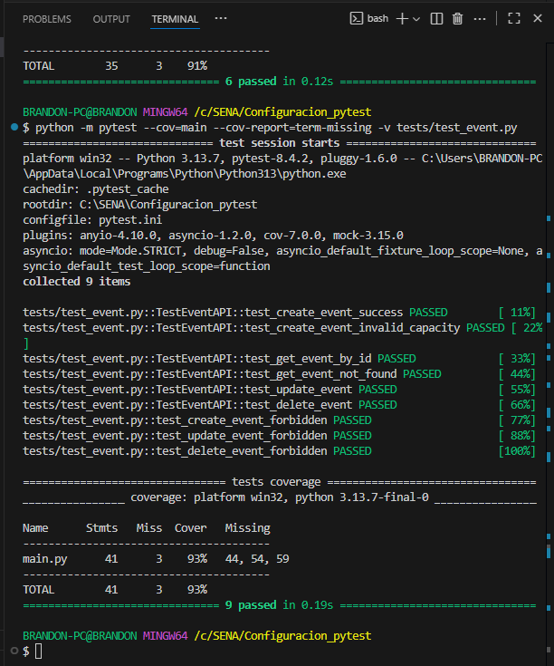

# 📋 Evidencia Prácticas 19, 20, 21 y 22 – Ficha 3147246

**Estudiante:** Brandon Díaz  
**Dominio:** Eventos  
**Semana:** 6  
**Repositorio:** `Configuracion_pytest`

---

## 🧪 Resultados de Pruebas (pytest)

- Total de pruebas ejecutadas: **9**
- Resultado: **9/9 PASSED ✅**
- Entorno: Python 3.13.7 – pytest 8.4.2 – pytest-cov 7.0.0

---

## 📊 Cobertura de Código

| Archivo   | Cobertura |
|----------|-----------|
| `main.py` | **93 %** ✅ (supera el mínimo de 80 %) |

---

## 📝 Conclusión

✔ Se implementó **Pytest Setup Personalizado** (Práctica 19)  
✔ Se desarrollaron tests CRUD para el dominio de eventos (Práctica 20)  
✔ Se añadió autenticación por roles (`x-role`) y se probaron accesos prohibidos (Práctica 21)  
✔ Se obtuvo una cobertura del **93 %**, superior al mínimo requerido (Práctica 22)  

---

## 📸 Evidencia

### Captura de pantalla de ejecución de pytest + cobertura

_Agrega aquí la captura de pantalla tomada de tu terminal:_  

